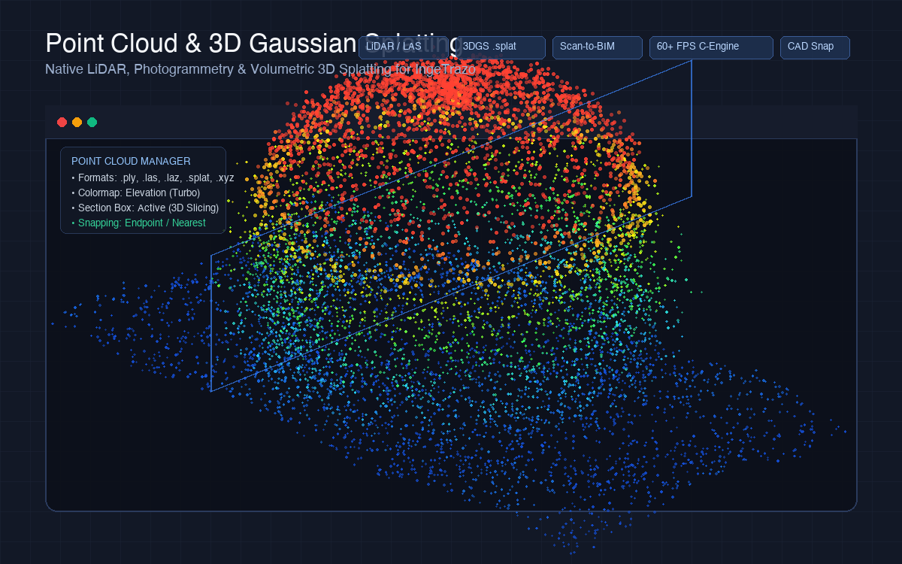

# Point Cloud & 3D Gaussian Splatting for IngeTrazo

[](https://ingetrazo.com)
[](https://www.gnu.org/licenses/gpl-3.0)
[](https://github.com/archimades27/ingetrazo-pointcloud-splat/releases/tag/v1.0.0)
[]()
[]()

> **The definitive high-performance Point Cloud (LiDAR, Photogrammetry) and 3D Gaussian Splatting (3DGS) extension for [IngeTrazo](https://ingetrazo.com) CAD/BIM modeler.**



---

## 📖 Overview

The **Point Cloud & 3D Gaussian Splatting** extension brings native, interactive reality-capture workflows directly inside **IngeTrazo**. It enables architects, engineers, surveyors, and 3D designers to import aerial drone scans, terrestrial LiDAR datasets, photogrammetry models, and volumetric radiance fields (*3D Gaussian Splats*), providing **sub-millisecond viewport rendering (up to 60+ FPS)**, architectural 3D section slicing, and **native CAD snapping** for precision as-built modeling and Scan-to-BIM reconstruction.

---

## 📊 Supported File Formats

| Format | Extension | Capabilities & Details |
| :--- | :--- | :--- |
| **Polygon File Format** | `.ply` | ASCII & Binary Little-Endian. Supports standard point clouds (XYZ + RGB + Normals) and full **3D Gaussian Splatting** datasets (Spherical Harmonics degrees 0–3, covariance scale factors, and rotation quaternions). |
| **LiDAR ASPRS Standard** | `.las`, `.laz` | Industry-standard airborne and terrestrial LiDAR format (ASPRS LAS 1.1 through 1.4). Supports double-precision georeferenced coordinates, 8-bit/16-bit RGB channels, and sensor reflectance intensity. |
| **Raw WebGL Splats** | `.splat` | Compact 32-byte chunk format commonly exported by modern photogrammetry pipelines and web viewers (antimatter15, Luma AI, Polycam, SuperSplat, KIRI Engine). |
| **ASCII Table Formats** | `.xyz`, `.pts`, `.txt`, `.csv` | Automatic delimiter detection (comma, space, tab). Automatically extracts XYZ coordinates, RGB color channels (0–255 or 0.0–1.0 floats), and intensity values. |

---

## 🌟 Key Features

### ⚡ 1. High-Performance Viewport Engine (Up to 60+ FPS)
* **Native C / SIMD Kernel**: Ships with an optimized C module (`fast_splat.c`) utilizing hardware acceleration and multi-threaded parallel depth-sorting (Apple Grand Central Dispatch / parallel bins) for instant splat projection and sub-millisecond rasterization.
* **Adaptive Dynamic LOD (Level of Detail)**: Dynamically adjusts render density and point budgets during rapid viewport navigation (orbit, pan, zoom) so interaction remains fluid without stutter, even on datasets exceeding tens of millions of points.
* **MultiView & Quad Viewport Integration**: Synchronizes rendering across all split viewports in IngeTrazo (Top Plan, Front Elevation, Right Elevation, and 3D Perspective/ISO).

### 🎨 2. Comprehensive Shading & Colormaps
* **True Color (RGB / SH)**: Renders natural surface colors captured by cameras or photogrammetric drones, including view-dependent spherical harmonics.
* **Elevation Colormaps**: Maps vertical height (Z-axis) into vibrant analytical gradients (**Turbo, Viridis, Jet, Terrain**)—ideal for site analysis, cut-and-fill grading, and topography visualization.
* **LiDAR Intensity**: Visualizes surface reflectivity to clearly distinguish asphalt roads, building facades, vegetation, and water bodies.
* **Surface Normals**: Colors points based on their normal vectors (RGB mapped to XYZ surface orientation).

### ✂️ 3. Interactive 3D Section Box / Clipping
* Real-time 3D clipping volume with independent Min/Max controls for the X, Y, and Z axes.
* Slice through dense point clouds instantly to inspect internal structural framing, isolate floor plan levels, or generate cross-section profiles.

### 🧲 4. Precision CAD Snapping (Snap-to-Cloud)
* Seamlessly connects point cloud geometry to IngeTrazo's native drafting tools (**Line Tool, Tape Measure, Push/Pull**).
* The cursor automatically snaps to the nearest cloud point with an interactive green snap circle, allowing users to trace as-built walls and measure true field dimensions without converting the point cloud into heavy meshes.

### 🏛️ 5. Automated Scan-to-BIM & Reverse Engineering
* **RANSAC Dominant Plane Detection**: Automatically extracts structural planar surfaces (walls, floors, ceiling slabs) from raw point clouds and generates native IngeTrazo face groups.
* **3D Oriented Bounding Box (OBB)**: Computes the tightest bounding volume enclosing a scan cluster.
* **Convert to Guide Points**: Converts key cloud points into permanent IngeTrazo construction guide points.

### 🧪 6. Built-in Procedural Synthetic Demos
* Experiment immediately without downloading gigabyte-sized scan files using built-in procedural generators:
  - **🏛️ Classic Facade**: Multi-story architectural facade with columns and window openings.
  - **🌐 Geodesic Dome**: Parametric hemispherical dome structure rendered as 3D Gaussian Splats.
  - **⛰️ Mountain Terrain**: Topographic terrain model colored with elevation colormaps.

---

## 🖥️ User Interface Overview

The **Point Clouds & Splats** dock panel appears in IngeTrazo's right tray dock:

| Panel Section | Features & Controls |
| :--- | :--- |
| **Datasets Manager** | Lists active scans, toggle visibility (eye icon), camera focus (center on dataset), opacity slider, and dataset removal. |
| **Display & Shading** | Choose shading mode (*RGB, Turbo, Viridis, Jet, Terrain, Intensity, Normals*), adjust point size (1–12 px), and configure splat scale. |
| **3D Transform & Gizmo** | Adjust Position Offset (X, Y, Z), Rotation Angles (Yaw, Pitch, Roll), and Uniform Scale Factor to align scans with CAD geometry. |
| **3D Section Box** | Toggle section box slicing and interactively adjust XYZ bounding bounds. |
| **CAD Snapping** | Enable/disable snap-to-cloud and adjust screen pixel search tolerance (10–50 px). |
| **Scan-to-BIM Tools** | One-click RANSAC Plane Extraction, 3D Bounding Box generation, and Guide Points creation. |

---

## 🚀 Installation

### Method 1: Official IngeTrazo Extensions Catalog (Recommended)
1. Visit the official catalog at [ingetrazo.com/extensiones](https://ingetrazo.com/extensiones).
2. Locate **Point Cloud & 3D Gaussian Splatting** and click **Download**.
3. Extract the downloaded archive to obtain the `pointcloud_splat` folder.
4. In IngeTrazo, go to **Extensions ▸ Open plugins folder** (*Extensiones ▸ Abrir carpeta de plugins*).
5. Copy the `pointcloud_splat` folder into that directory.
6. Restart IngeTrazo.

### Method 2: Manual Installation from this Repository
Clone or copy the `pointcloud_splat` folder directly into your platform's IngeTrazo plugin directory:

* **macOS**:
  ```bash
  cp -r pointcloud_splat/ "$HOME/Library/Application Support/IngeTrazo/plugins/"
  ```
* **Linux**:
  ```bash
  cp -r pointcloud_splat/ "$HOME/.local/share/ingetrazo/plugins/"
  ```
* **Windows**:
  Copy the `pointcloud_splat` folder into `%APPDATA%\IngeTrazo\plugins\`.

---

## 🎯 Quick Start Workflow

1. Launch **IngeTrazo**.
2. Open the menu: **Extensions > Point Cloud & Gaussian Splatting…** or press **`Ctrl+Shift+P`**.
3. **Import a file**:
   * Click **Import File...** in the panel, OR
   * **Drag and drop** any `.ply`, `.las`, `.laz`, `.splat`, or `.xyz` file directly into the 3D viewport.
4. Select your preferred colormap (e.g., **Elevation - Turbo** for topography or **True Color RGB** for photogrammetry).
5. Select the native **Line Tool** or **Tape Measure** and start modeling directly over the scan with snapping enabled!

---

## 📦 Building Distribution Packages

To package the extension for distribution or verify checksums:
```bash
python3 tools/build_package.py
```
This utility:
1. Filters development artifacts (`.DS_Store`, `__pycache__`).
2. Bundles the root `pointcloud_splat/` folder into `dist/pointcloud_splat.zip`.
3. Calculates the SHA-256 cryptographic digest.
4. Synchronizes the hash into `pointcloud_splat.toml`.

---

## 📄 License

This project is free software licensed under the **[GNU General Public License v3.0 (GPL-3.0-or-later)](LICENSE)**.

```text
Copyright (C) 2026 Archimades (archimades27) and IngeTrazo contributors.
```
You are free to use, inspect, modify, and redistribute this software under the terms of the GNU GPLv3 license.
